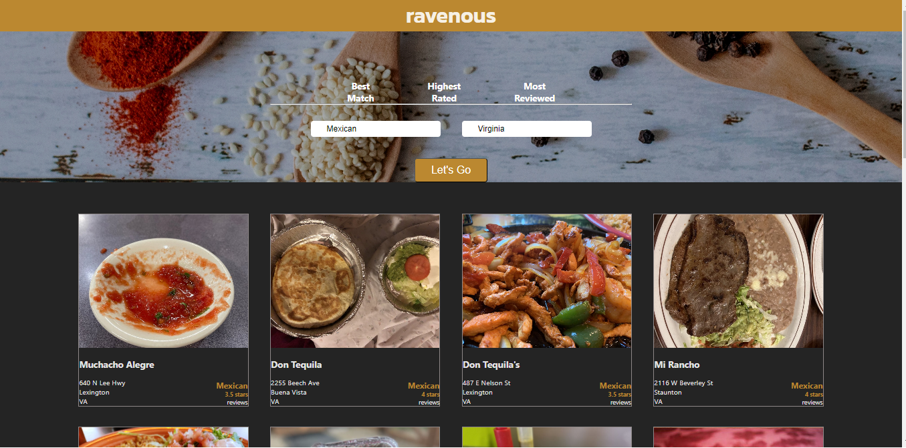
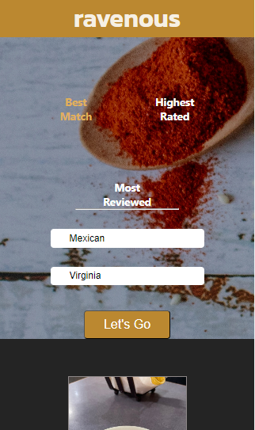

# Ravenous project - Web Development and Front-end path project at Codecademy

This is a solution to the [Ravenous project at codecademy](https://www.codecademy.com/paths/web-development/tracks/front-end-applications-with-react/modules/ravenous-part-four/projects/interacting-with-yelp-api).

## Table of contents

- [Overview](#overview)

   - [The challenge](#the-challenge)
   - [Screenshots and videos](#screenshots-and-videos)
   - [Links](#links)

- [My process](#my-process)

   - [Built with](#built-with)
   - [What I learned](#what-i-learned)
   - [Continued development](#continued-development)
   - [Useful resources](#useful-resources)

- [Author](#author)
- [Acknowledgments](#acknowledgments)

## Overview

### The challenge

The challenge consisted of building a web application that used the Yelp API to display and recommend all kinds of businesses, especially restaurants, mostly within the United States. Using a tech stack that includes HTML, CSS, JavaScript, React, and the Yelp API, the idea was to create an application that replicates the core functionality of [Yelp](https://www.yelp.com/).

### Project Requirements (as shown in Codecademy):

- Build the restaurant recommendation application using React.
- Utilize HTML, CSS, and JavaScript as part of the tech stack.
- Version control your application with Git and host the repository on GitHub.
- Write a README (using Markdown) that documents your project, including:
   - The purpose of your project.
   - Technologies used.
   - Features.
   - Future work.

#### Features

- The website allows users to scroll up and down to navigate through its content.
- Users can simulate a search by typing in the search bar.
- A list of mock restaurant data is presented to the user.

#### Prerequisites

- HTML
- CSS
- JavaScript
- React
- Git and GitHub
- HTTP Requests and Responses
- Authentication

### Screenshots and videos

I'm not going to deploy the site on Netlify to avoid API key abuse, but here is a GIF of the working website (it can be found in public/preview.gif):

Basic landpage after a search is made looks like this in desktop screensize:

### Links

- Solution URL: [GitHub repo](https://github.com/light-roast/ravenous)

## My process

### Built with

- Semantic HTML5 markup
- CSS custom properties
- Flexbox
- CSS Grid
- Responsive design pattern
- [React](https://reactjs.org/) - JS library
- [Styled Components](https://styled-components.com/) - For styles.
- New Date() object.
- Vite react create -> Runs with `nmp run dev`.
- .env file gitignored that contains the API key. If you want to fork this and make it work you have to create your own API key at Yelp and store in a root .env file following this patter: `VITE_API_KEY= "Bearer api-key-here"`.

### What I learned

"My most authentic learning experience with this project was learning to develop using a private API like Yelp's. In this company, they have the ways to make API calls very well documented. However, CORS restrictions gave me some headaches, especially because I couldn't find in any available help material that the header should be specified with this information: `Access-Control-Allow-Origin': '*` (see yelp.js in wich I handle the logic to fetch from Yelp API -> `./src/utils/yels.ys`). To discover this, I had the help of my reliable and kind friend, who is also a senior full-stack developer. I will acknowledge him in the [acknowledgments section](#acknowledgments)."

### Continued development

I want to learn the basics of testing for this kind of React app, specifically guided by the question: what should I test in this specific app?

### Useful resources

- [Yelp API documentation](https://docs.developer.yelp.com/docs/fusion-intro)

## Author

- Website - [Daniel Echeverri LLano](https://light-roast.github.io/portafolio/)
- Frontend Mentor - [@light-roast](https://www.frontendmentor.io/profile/light-roast)
- Twitter - [@echeverri_llano](https://www.twitter.com/echeverri_llano)

## Acknowledgments

- [Juan Sebastián Silva](https://github.com/juansesilva) helped me with his expert feedback on the app's behavior and responsive design. He also guided me on how to correctly fetch data from the Yelp API by setting the header of the request correctly.

