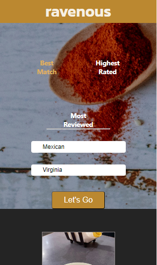

# Ravenous project - Web Development and Front-end path project at Codecademy

This is a solution to the [Ravenous project at codecademy](https://www.codecademy.com/paths/web-development/tracks/front-end-applications-with-react/modules/ravenous-part-four/projects/interacting-with-yelp-api).

## Table of contents

- [Overview](#overview)

   - [The challenge](#the-challenge)
   - [Screenshots and videos](#screenshots-and-videos)
   - [Links](#links)

- [My process](#my-process)

   - [Built with](#built-with)
   - [What I learned](#what-i-learned)
   - [Continued development](#continued-development)
   - [Useful resources](#useful-resources)

- [Author](#author)
- [Acknowledgments](#acknowledgments)

## Overview

### The challenge

The challenge consisted of building a web application that used the Yelp API to display and recommend all kinds of businesses, especially restaurants, mostly within the United States. Using a tech stack that includes HTML, CSS, JavaScript, React, and the Yelp API, the idea was to create an application that replicates the core functionality of [Yelp](https://www.yelp.com/). 

### Project Requirements (as shown in Codecademy):

- Build the restaurant recommendation application using React.
- Utilize HTML, CSS, and JavaScript as part of the tech stack.
- Version control your application with Git and host the repository on GitHub.
- Write a README (using Markdown) that documents your project, including:
  - The purpose of your project.
  - Technologies used.
  - Features.
  - Future work.

#### Features

- The website allows users to scroll up and down to navigate through its content.
- Users can simulate a search by typing in the search bar.
- A list of mock restaurant data is presented to the user.

#### Prerequisites

- HTML
- CSS
- JavaScript
- React
- Git and GitHub
- HTTP Requests and Responses
- Authentication

### Screenshots and videos

Basic land page after a search is made looks like this in desktop screensize:




```html
<video controls>
    <source src="./public/showcase.mp4" type="video/mp4">
    Your browser does not support the video tag.
  </video>
```

```js

```

```js

```


### Links

- Solution URL: [GitHub repo](https://github.com/light-roast/calculateageapp)
- Live Site URL: [Live Site](https://calculate-your-real-age.netlify.app/)

## My process

### Built with

- Semantic HTML5 markup
- CSS custom properties
- Flexbox
- CSS Grid
- Responsive design pattern
- [React](https://reactjs.org/) - JS library
- [Styled Components](https://styled-components.com/) - For styles.
- New Date() object.

### What I learned

I learned a lot while completing this project. Handling numerous form interactions, especially checking for leap years, allowed me to create an interesting function. Using just React.js and CSS to style error validations instead of relying on default HTML validations was a major challenge, but I learned a lot by successfully doing so.

Calculating the real age was surprisingly difficult for me at first. I had to watch multiple YouTube videos on how to calculate age in years, months, and days to come up with a JS solution using React. State management with `useState()` and `useEffect()` were key components of this solution.

This is the leap year check:

```js
 useEffect(() => {
        
        if ((0 === year % 4) && (0 !== year % 100) || (0 === year % 400)) {
            setDaysInMonth(prevDaysInMonth => {
                const updatedDaysInMonth = [...prevDaysInMonth]; 
                updatedDaysInMonth[1] = 29;
                return updatedDaysInMonth;
              });
        } else {
            setDaysInMonth(prevDaysInMonth => {
                const updatedDaysInMonth = [...prevDaysInMonth]; 
                updatedDaysInMonth[1] = 28;
                return updatedDaysInMonth;
        });
          };

        
    }, [year]);
```

And this is the real age calculation function:

```js
function calculateRealAge(year, month, day, monthArr) {
    const actualDate = new Date();
    let d = actualDate.getDate();
    let m = actualDate.getMonth()+1;
    console.log(m);
    let y = actualDate.getFullYear();
      
    if (d < day) {
      m--;
      let actualDays = d + (monthArr[m+1]);
      let realDays = actualDays - day;
      setDays(realDays);
    } else {
      let realDays = d - day;
      setDays(realDays);
    }

    if (m < month) {
      y--;
      m += 12;
      let realMonths = m - month;
      setMonths(realMonths);
    } else {
      let realMonths = (m - month);
      setMonths(realMonths);
    }
  
    setYears(y-year);
  };
```

### Continued development

I would like to see a solution for this project that uses only flexbox, since I still struggle a bit with its usage. Additionally, I want to learn the basics of testing for this kind of React app, specifically guided by the question: what should I test in this specific app?

### Useful resources

- [YouTube video tutorial to calculate real age](https://www.youtube.com/watch?v=zKhOOkUEw5U) - This video helped me to understand te basic math calculations to return the real age in days, months and years.

## Author

- Website - [Daniel Echeverri LLano](https://light-roast.github.io/portafolio/)
- Frontend Mentor - [@light-roast](https://www.frontendmentor.io/profile/light-roast)
- Twitter - [@echeverri_llano](https://www.twitter.com/echeverri_llano)

## Acknowledgments

- [Juan Sebastián Silva](https://github.com/juansesilva) helped me with his expert feedback on the app's behavior and responsive design. He also helped me understand how to correctly import the icon image into the Vite React project so that it builds successfully.

